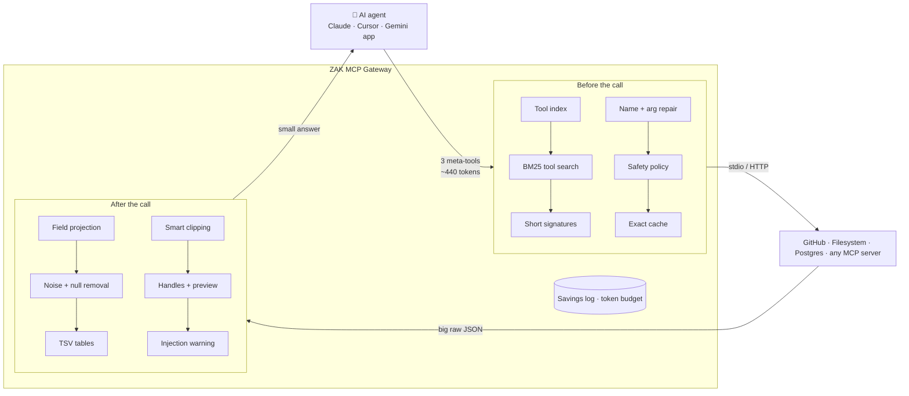
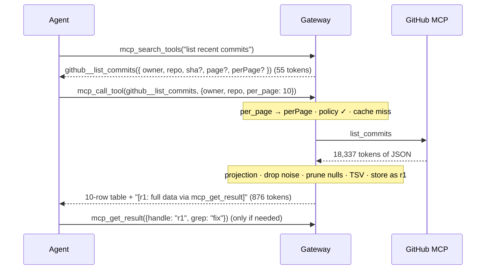

<div align="center">

# ZAK MCP Gateway

**A token-optimized gateway for the Model Context Protocol (TO-MCP)**

One MCP server for your agent, every MCP server behind it, at a fraction of the tokens.


[Why](#-why) · [Results](#-measured-results) · [How it works](#-how-it-works) · [Quick start](#-quick-start) · [Configuration](#%EF%B8%8F-configuration) · [Testing](#-testing--benchmarks) · [Docs](#-documentation)

</div>

---

## 💡 Why

When an AI agent connects to MCP servers, it pays for tokens in two places:

| | Problem | Example (GitHub MCP server) |
|---|---|---|
| **Before the call** | Every tool's full JSON schema is sent with *every* model request, even if only one tool is used. | 26 tools = **3,600 tokens** per request |
| **After the call** | Tools return huge raw JSON: avatars, API links, IDs, pretty-printing. All of it stays in the conversation. | 10 commits = **18,337 tokens** |

The ZAK gateway sits between the agent and your MCP servers and cuts tokens in **both directions**, without changing the agent or the servers.

> **Analogy:** without the gateway, asking a hotel desk for a taxi gets you the manual for every hotel service, then the driver's full employment file. The gateway is a good concierge: a one-page directory, a short answer, and the full file kept in the back office in case you need it.

## 📊 Measured results

**GitHub MCP server** (public repo `modelcontextprotocol/servers`, 26 tools, o200k tokenizer, 9 read-only tasks, same calls in every setup). Reproduce with `npm run bench:compare -- <older dist dir>`.

| Metric | No gateway | v0.3 | **v0.4 tuned** |
|---|---:|---:|---:|
| Tool definitions per model request | 3,600 | 541 | 641 |
| Whole agent run, input tokens | 1,822,172 | 75,586 – 101,171 | **58,715** – 80,603 |
| Model requests | 12 | 13 – 18 | **11** – 16 |
| Saved vs no gateway | – | 95.9% | **96.8%** |

Ranges: low = the agent calls tools by name, high = it searches before every new tool. The realistic comparison is **v0.3 searching (101,171) vs v0.4 with pinned signatures, no search needed (58,715): −42%**. "Tuned" = pinned signatures, `groups` catalog, slim meta-tools, one-line search, and one workflow; with default settings v0.4 measures exactly like v0.3.

**Your company lean server** (measured by you on gateway v0.3, every write checked in the database):

| Task | Lean alone | Lean + its batch tool | Gateway v0.3 → lean |
|---|---:|---:|---:|
| Light: read and inspect | 98,493 | – | **41,054** (−58%) |
| Heavy: build and verify | 261,990 | 201,090 | **102,628** (−49%) |
| Heavy, searches removed (derived) | – | – | **45,346**, which is what v0.4's pinned signatures target |

<details>
<summary><b>Per-task breakdown and honest limits</b></summary>

| Task | No gateway | v0.3 | v0.4 tuned | What made the difference in v0.4 |
|---|---:|---:|---:|---|
| `list_commits` (10) | 18,337 | 876 + 84 search | 876 + 67 search | one-line search reply |
| `list_commits` (30), sha + message | 61,589 | 1,280 | 1,280 | same |
| `list_issues` (20 open) | 37,846 | 909 + 157 search | 909 + 118 search | leaner search |
| `list_pull_requests` (10) | 27,375 | 839 + 223 search | 839 + 120 search | leaner search |
| `search_repositories` (10) | 3,470 | 485 + 144 search | 485 + 71 search | leaner search |
| README | 2,498 | 1,212 + 133 search | 1,212 + 70 search | leaner search |
| `list_commits` again | 18,337 | 876 (cache) | 876 (cache) | same |
| "How many of 30 open issues are PRs?" | 52,148 | 909 + 55 `count` | 909 + 55 `count` | same |
| Repo overview (commits, issues, PRs) | 32,232 · 3 turns | 753 · 3 turns | 808 · **1 turn** | workflow tool |

- Pinned signatures cost ~100 tokens per turn; they pay off only by removing searches. Pin the 10–12 tools used most.
- Workflows help multi-step jobs most; this read-only test has only one (the overview). Build tasks like your heavy task gain more.
- Read-only benchmark: write receipts, batch writes, `$ref`/patch, trimming and skills are covered by tests (65), not by this run.
- With only a handful of small tools the gateway costs more than direct MCP; it pays off with many tools or big results.
- Inside Claude Code, MCP is ~2.6% of all input, so whole-session savings there are small. MCP-heavy agents gain the most.
- The o200k tokenizer stands in for Claude/Gemini. Real-model check so far: one Gemini A/B (20,806 → 2,522 input tokens, −87.9%).

</details>

## 🧠 How it works



### The life of one request



### Techniques at a glance

| Technique | Where | What it does | Everyday analogy |
|---|---|---|---|
| **Meta-tools** | before | The agent sees `mcp_search_tools`, `mcp_call_tool`, `mcp_get_result` instead of every schema | One concierge desk instead of 40 counters |
| **Tool index** | before | One line per server listing tool names, sent as MCP `instructions` | The lobby directory |
| **BM25 tool search** | before | MiniSearch with fuzzy/prefix matching and synonyms (`PR` → pull request) | Asking a librarian |
| **Short signatures** | before | JSON Schema → one TypeScript-style line; complex `$ref` schemas keep the full minified version | A recipe card, not the cookbook |
| **Name + argument repair** | before | `github::x` → `github__x`, `per_page` → `perPage`, `"5"` → `5`; real errors return the signature | A clerk fixing a misspelled address |
| **Exact-match cache** | before | SHA-256 LRU cache for read tools; any write clears that server's cache | A cafe that remembers your usual order |
| **Safety policy** | before | Read-only modes, allow/deny globs, writes need `confirm: true` | A teller asking for your signature |
| **Field projection** | after | `project_fields` or per-tool defaults; works through lists | A highlighter |
| **Noise + null removal** | after | Drops `*_url`, `node_id`, nulls, empty values | Throwing away junk mail |
| **TSV tables** | after | Lists render as a table when smaller than JSON | A spreadsheet, not a letter per row |
| **Smart clipping** | after | Only when over budget: clips long text, keeps as much of a single document as fits | Reading with a bookmark |
| **Handles + preview** | after | Big results stay in the gateway; page, grep, project, or `raw:true` | A coat-check ticket |
| **Injection warning** | after | Flags "ignore previous instructions"-style text as untrusted data | An "unverified sender" stamp |
| **Savings log + budget** | around | JSONL log, `report` command, `zak://stats`, optional session budget | An electricity meter / prepaid plan |
| **Code mode** *(opt-in)* | around | JS that calls several read tools inside the gateway; only the answer returns | One errand runner, one receipt |
| **Passthrough baseline** | around | `--passthrough` = plain MCP through the same config, for fair A/B tests | Same scale, before and after |
| **Compact search** *(0.3)* | before | Top hit as a full signature, the rest as name + summary (`detail:"full"` for all) | A shortlist, not the whole catalog |
| **Catalog modes + hot signatures** *(0.3)* | before | Index as `names`, `groups` (`{create,get,list}_issue`), `servers` or `off`; most-used tools' signatures from the stats log | The building directory, with the popular shops on top |
| **Server notes, synonyms, default args** *(0.3)* | before | Forward each server's own instructions; per-server vocabulary; inject page size / server-side field selection | Passing on the house rules; knowing the local words |
| **Batch calls** *(0.3)* | before | Several calls in one turn; writes preview first, then run on one confirmation | One trip to the shop with a full list |
| **Safe cache** *(0.3)* | before | Per-tool read/write overrides, `writeIf` by argument, cache groups across servers, TTL, `fresh` | Clearing every copy of the menu when one changes |
| **Per-server distill modes** *(0.3)* | after | `full` / `light` (compact servers: no reshaping, bigger limit) / `off` | Don't re-pack what is already packed |
| **Aggregation + path** *(0.3)* | after | `count`, `group_by`, `distinct`, `sort`, one field in full by path, on stored results | Asking the clerk for the total, not every receipt |
| **Write receipts** *(0.3)* | after | `{ok, id, ...}` instead of the full echo; echo behind a handle | A receipt, not a copy of the whole order |
| **`$ref` + patch** *(0.3)* | around | Pass stored data into another call (even another server), with find/replace edits | Forwarding a parcel without opening it |
| **Rules + skills** *(0.3)* | around | Rules in the instructions, skill index, `mcp_get_skill`, best skill suggested in search | The team handbook, available to every assistant |
| **Elicitation + sampling passthrough** *(0.3)* | around | Downstream servers can ask the user or the model through the gateway | Putting a call through to the right desk |
| **Sandboxed code mode** *(0.3)* | around | Separate process, Node permission model (no fs/child processes), memory cap, hard timeout | A locked workroom with one phone line |
| **Pinned signatures** *(0.4)* | before | Chosen tools always listed with one-line signatures, so writes need no search | Daily numbers on a sticky note |
| **Workflow tools** *(0.4)* | around | A configured multi-step job in one call (`wf__name`): values flow between steps, one confirmation, precise failure report, trimmed output | "The usual, please" |
| **Workflow suggestions** *(0.4)* | around | `npm run report` finds repeated call sequences and prints a workflow skeleton to review | A waiter noticing your usual order |
| **Slim meta-tools, lean search** *(0.4)* | before | Shorter descriptions every turn; one-line search hits; repeated tool inventories dropped | A pocket card instead of a brochure |
| **Name-aware search ranking** *(0.4)* | before | Name matches beat descriptions that repeat a common word; "how many" finds count tools | Finding the shop by its sign |
| **Multi-table replies** *(0.4)* | after | A reply with several lists becomes several small tables | One spreadsheet tab per list |

## 🚀 Quick start

**Requirements:** Node.js 20+ and npm. `npx` downloads the downstream MCP servers on first run.

```bash
git clone https://github.com/z4kir/zak-mcp-gateway.git
cd zak-mcp-gateway
npm install
npm run build

cp config/servers.example.json config/servers.json   # then edit paths / servers
export GITHUB_PERSONAL_ACCESS_TOKEN=ghp_...          # optional for public repos (PowerShell: $env:GITHUB_PERSONAL_ACCESS_TOKEN="...")

node dist/cli.js --config config/servers.json
```

### Use it from Claude Desktop, Cursor, or Claude Code

Add one server entry and remove the individual servers it now fronts:

```json
{
  "mcpServers": {
    "zak-gateway": {
      "command": "node",
      "args": ["/absolute/path/zak-mcp-gateway/dist/cli.js", "--config", "/absolute/path/zak-mcp-gateway/config/servers.json"],
      "env": { "GITHUB_PERSONAL_ACCESS_TOKEN": "ghp_..." }
    }
  }
}
```

### CLI

```text
zak-mcp-gateway [--config <servers.json>] [--passthrough]
zak-mcp-gateway report [--config <servers.json> | --log <stats.jsonl>] [--session <id>]

  --passthrough   expose every downstream tool raw (baseline for A/B measurement)
  report          summarize token savings from the stats log
```

## 🧰 What the agent sees

| Tool | Arguments | Purpose |
|---|---|---|
| `mcp_search_tools` | `query`, `limit?` | Find tools on all servers; returns compact signatures |
| `mcp_call_tool` | `tool_name`, `arguments`, `project_fields?`, `confirm?` | Run a tool; result is distilled; big results return a preview + handle |
| `mcp_get_result` | `handle`, `offset?`, `limit?`, `grep?`, `fields?`, `raw?` | Page, grep, or project a stored result; `raw:true` = original text |
| `mcp_run_code` | `code` | *(only if `codeMode.enabled`)* run JS with `await call(tool, args)` in a sandboxed process |
| `mcp_get_skill` | `name` | *(only if skills are configured)* load a skill's full instructions |

`mcp_call_tool` also takes `calls: [...]` (batch), `fresh: true`, `full: true`, and any argument value may be `{"$ref": "r3", "path": "...", "replace": [{"find", "replace"}]}`. `mcp_get_result` also takes `count`, `group_by`, `distinct`, `sort` (`"-x"` = descending), `path` and `max_tokens`.

Plus the **instructions** (one-line tool index per server) and the resource **`zak://stats`** (live savings for the session).

## ⚙️ Configuration

Full example: [`config/servers.example.json`](config/servers.example.json).

```jsonc
{
  "gateway": {
    "cache":     { "enabled": true, "exactMatchTtlSeconds": 300, "maxEntries": 1000 },
    "discovery": { "maxSearchResults": 5, "minScore": 0.2, "catalogInInstructions": true },
    "results":   { "inlineTokenLimit": 1500, "previewRows": 10, "maxStringChars": 600, "tsv": true },
    "safety":    { "readOnly": false, "confirmWrites": true, "allow": [], "deny": [], "warnOnInjection": true },
    "stats":     { "enabled": true, "logFile": "../.zak-gateway/stats.jsonl", "sessionTokenBudget": 0 },
    "codeMode":  { "enabled": false, "timeoutMs": 30000, "maxToolCalls": 25 }
  },
  "mcpServers": {
    "github": {
      "command": "npx",
      "args": ["-y", "@modelcontextprotocol/server-github"],
      "env": { "GITHUB_PERSONAL_ACCESS_TOKEN": "${GITHUB_PERSONAL_ACCESS_TOKEN}" },
      "projections": { "list_commits": ["sha", "commit.message", "commit.author.name"] },
      "dropKeys": ["url", "permissions", "reactions"]
    },
    "github-remote": {
      "url": "https://api.githubcopilot.com/mcp/",
      "headers": { "Authorization": "Bearer ${GITHUB_PERSONAL_ACCESS_TOKEN}" }
    }
  }
}
```

| Key | Meaning |
|---|---|
| `env` / `headers` / `args` | `${VAR}` and `${VAR:-default}` read from the environment. Placeholders like `<YOUR_TOKEN>` are ignored; hard-coded tokens trigger a warning. |
| `command` / `url` | stdio server, or remote Streamable HTTP server (falls back to SSE) |
| `projections` | Default fields per tool, used when the agent sends no `project_fields` |
| `dropKeys` | Extra noise keys (glob) for this server, on top of `results.dropKeys` |
| `readOnly` | Block every write tool on this server |
| `pinned` | Also expose this server's tools directly (full schemas, every request; use sparingly) |
| `safety.confirmWrites` | Write tools need `confirm: true`, sent after the user agrees |
| `stats.sessionTokenBudget` | Results get half the room at 80%; calls stop at 100% |
| `results` *(per server)* | `inlineTokenLimit`, `maxStringChars`, `distill: full \| light \| off`, `writeReceipts` |
| `synonyms`, `defaultArgs`, `forwardInstructions` | Per-server search vocabulary, injected default arguments, forwarding of the server's own instructions |
| `access`, `writeIf`, `cache`, `cacheTtlSeconds`, `cacheGroup` | Per-tool read/write overrides, argument-based writes, per-server cache control and shared invalidation |
| `discovery.catalog` / `fullSignatures` / `hotSignatures` | Tool index size, full signatures per search, most-used signatures in the instructions |
| `knowledge.rules` / `rulesFile` / `skillsDir` | Rules and skills (`<name>/SKILL.md` or `<name>.md`, front matter `name`/`description`) for every client |
| `clientFeatures.elicitation` / `sampling` | Forward downstream user prompts / model requests to the agent's client (off by default) |
| `codeMode.isolation` / `memoryMb` | `process` (default, sandboxed) or `vm` (trusted only) |
| `results.dedupe` | A byte-identical repeat result becomes a one-line pointer |
| `discovery.pinnedSignatures` *(0.4)* | Globs of tools whose one-line signatures are always in the instructions (e.g. the 10–12 most-used write tools, `wf__*`) |
| `discovery.metaToolStyle` / `signatureStyle` / `alsoStyle` *(0.4)* | `slim` meta-tools; search hits as `oneline`; other hits by `name` only |
| `workflows` *(0.4)* | Named multi-step jobs: `description`, `input`, `steps[] {id, tool, arguments, forEach, fields, report}`, `output`. Templates: `${input.x}`, `${steps.id.path}`, `${item}`. See `config/servers.example.json` |

**Workflow example** (the agent calls `wf__repo_overview` once instead of three tools):

```json
"workflows": {
  "repo_overview": {
    "description": "Latest commits, open issues and open PRs of a repo in one call. Not for details of one item.",
    "input": { "properties": { "owner": { "type": "string" }, "repo": { "type": "string" } }, "required": ["owner", "repo"] },
    "steps": [
      { "id": "commits", "tool": "github__list_commits", "arguments": { "owner": "${input.owner}", "repo": "${input.repo}", "perPage": 5 }, "fields": ["sha", "commit.message"] },
      { "id": "issues", "tool": "github__list_issues", "arguments": { "owner": "${input.owner}", "repo": "${input.repo}", "state": "open", "per_page": 5 }, "fields": ["number", "title"] }
    ],
    "output": { "commits": "${steps.commits}", "issues": "${steps.issues}" }
  }
}
```

Every step goes through the normal safety rules; writes need one `confirm: true` for the whole workflow; it stops at the first failure and says which steps ran; each step's full reply stays behind a handle.

Tools are classed **read** or **write** from MCP `readOnlyHint` annotations first, then from verbs in the name. Unknown verbs count as **write**, so they are never cached and always need confirmation.

## 🧪 Testing & benchmarks

| Command | What it does |
|---|---|
| `npm test` | Build + 65 unit, integration and feature tests (full MCP round trips against a mock server) |
| `npm run test:github` | Live check through the real CLI over stdio against the GitHub MCP server (no token needed for public repos) |
| `npm run bench:github` | Live A/B token benchmark: passthrough vs gateway (`GITHUB_REPO=owner/name` to change the repo) |
| `npm run bench:compare -- <dir> [--only tuned]` | Live benchmark: no gateway vs an older build (`<dir>` = its `dist`) vs this build (defaults and tuned) |
| `npm run report` | Savings report from `.zak-gateway/stats.jsonl`: per tool, turns by kind, suggested default fields |

### Agent UI (real-model A/B)

[`agent-ui/`](agent-ui) is a Next.js app that runs a Gemini agent through **Direct MCP** (`--passthrough`) and the **Gateway** on the same prompt, and shows Gemini's own token usage side by side.

```bash
npm run build                 # the UI starts ../dist/cli.js
cd agent-ui && npm install && npm run dev
# open http://localhost:3000, enter a Gemini key (or set GEMINI_API_KEY), choose "Both (A/B)"
```

Optional env: `GEMINI_MODEL`, `GATEWAY_ROOT`, `GATEWAY_CONFIG`.

## 📁 Project structure

```text
zak-mcp-gateway/
├── src/
│   ├── cli.ts                        # serve · --passthrough · report
│   ├── config/                       # zod schema, loader, ${VAR} secrets
│   ├── downstream/client-pool.ts     # parallel stdio + HTTP connections, server__tool names
│   ├── discovery/                    # MiniSearch BM25 + synonyms, catalog modes
│   ├── knowledge/                    # rules + skills for every client
│   ├── synthesizer/ts-transpiler.ts  # JSON Schema → compact signature
│   ├── gate/                         # read/write classifier, SHA-256 LRU cache, safety policy
│   ├── execution/                    # dispatcher, batch, argument repair, $ref + patch, sandboxed code mode
│   ├── distiller/                    # projection, noise keys, nulls, TSV, previews, injection flag
│   ├── results/result-store.ts       # handles for big results
│   ├── stats/token-stats.ts          # JSONL savings log + budget
│   ├── server/                       # meta-tools + MCP server
│   └── util/                         # token estimator, logger, glob
├── tests/                            # unit, integration, live GitHub test, benchmarks, fixtures
├── agent-ui/                         # Next.js + Gemini A/B harness
├── config/servers.example.json
└── docs/                             # PDFs (HTML sources in docs/src)
```

## 📚 Documentation

| Document | Contents |
|---|---|
| [ZAK_Gateway_How_It_Works.pdf](docs/ZAK_Gateway_How_It_Works.pdf) | **Start here.** Every technique in plain words, diagrams, analogies, measured results (v0.4) |
| [docs/versions/](docs/versions) | One release note per version: what is new, fixed and measured |
| [MCP_Gateway_Architecture_and_Build_Plan.pdf](docs/MCP_Gateway_Architecture_and_Build_Plan.pdf) | The build plan this version implements |
| [LAUNCH_CONFIGURATIONS_GUIDE.html](docs/LAUNCH_CONFIGURATIONS_GUIDE.html) | VS Code launch and debug configurations |
| [Token-Optimized MCP Architecture Whitepaper.pdf](docs/Token-Optimized%20MCP%20Architecture%20Whitepaper.pdf) · [CONCEPT_EXPLAINER.pdf](docs/CONCEPT_EXPLAINER.pdf) · [IMPLEMENTATION_ROADMAP.pdf](docs/IMPLEMENTATION_ROADMAP.pdf) | Earlier concept docs (their benchmark figures are projections, not measurements) |

## 🗺️ Roadmap

| Plan phase | Status |
|---|---|
| 1 · Core gateway (config, connections, search, signatures, meta-tools) | ✅ done |
| 2 · Result handling (TSV, nulls, handles, slicing, grep, projection) | ✅ done |
| 3 · Stats (savings log, report, session budget) | ✅ done |
| 4 · Safety (read-only, confirm writes, allow/deny, injection warning, env secrets) | ✅ done |
| 5 · Benchmark (10–20 real-model tasks over 3+ servers, success rates) | 🟡 GitHub 3-way benchmark + live Gemini runs done; multi-server real-model run pending |
| 6 · Advanced (sandboxed code mode, safe cache, tool preload, suggested default fields ✅; cheap-model router ⏳) | 🟡 mostly done |
| Economy plan (14 ideas) + weak-model precision plan | ✅ v0.3: all 14 ideas plus 6 extras; agent UI: focused tools, history trimming, verifier, skill preload |
| Next-steps plan (7 improvements) | ✅ v0.4: pinned signatures, workflow tools + suggestions, cheaper turns, leaner search, search fix; trimming + caching documented for hosts |
| Next | ⏳ Re-run the company lean benchmark with pinned write signatures + a build workflow; live-model run; evaluation set; name → ID resolution |

## 🏷️ Versions

Each version has a short release note (what is new, what was fixed, what was measured) in [`docs/versions/`](docs/versions). Rebuild them with `node docs/src/versions/build-versions.mjs`.

| Version | Date | Theme | Highlights | Release note |
|---|---|---|---|---|
| **0.4.0** | 6 Oct 2026 | Fewer turns, cheaper turns | Pinned signatures, workflow tools + suggestions, slim meta-tools, lean search replies, name-aware search ranking, multi-table replies. Fixes: workflow output trimming, search ranking. GitHub: −42% vs v0.3 (searching vs pinned). | [v0.4](docs/versions/ZAK_Gateway_v0.4.pdf) |
| 0.3.0 | 5 Oct 2026 | Economy upgrade | Per-server modes, compact search, catalog modes, hot signatures, batch, default args, aggregation, safe cache, receipts, `$ref` + patch, rules + skills, elicitation/sampling, sandboxed code mode; agent-UI helpers. Lean: −58% / −49%. | [v0.3](docs/versions/ZAK_Gateway_v0.3.pdf) |
| 0.2.0 | 4 Oct 2026 | Build-plan upgrade | Handles, noise removal + TSV, safety policy, stats + report + budget, argument repair, remote servers, `${VAR}` secrets, passthrough A/B; many v0.1 bugs fixed. GitHub: −93%. | [v0.2](docs/versions/ZAK_Gateway_v0.2.pdf) |
| 0.1.0 | 2–3 Oct 2026 | First scaffold | Two meta-tools, BM25 search, TypeScript signatures, SHA cache, projection, null pruning. | [v0.1](docs/versions/ZAK_Gateway_v0.1.pdf) |

## 📄 License

MIT. See `license` in [`package.json`](package.json).
