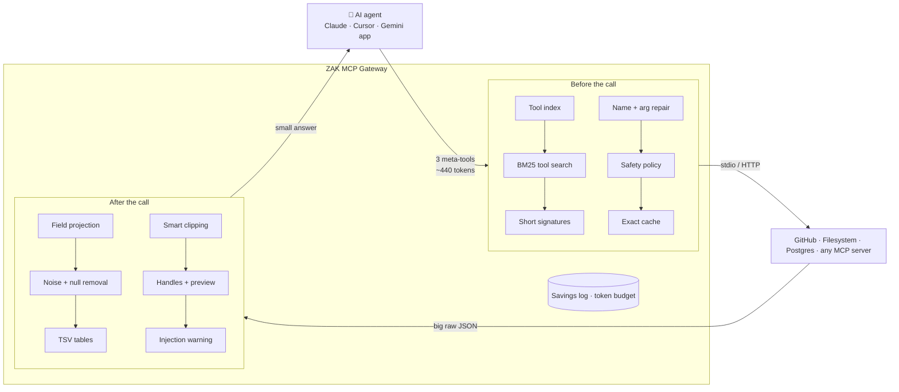
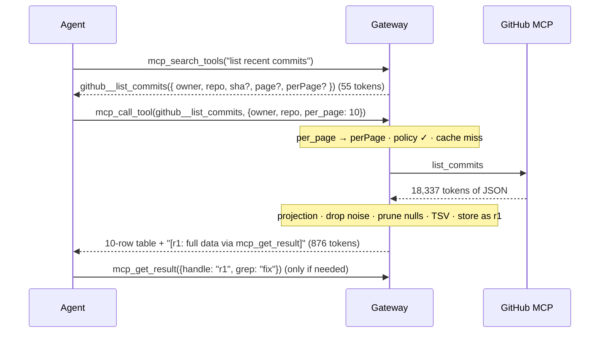

<div align="center">

# ZAK MCP Gateway

**A token-optimized gateway for the Model Context Protocol (TO-MCP)**

One MCP server for your agent, every MCP server behind it, at a fraction of the tokens.


[Why](#-why) · [Results](#-measured-results) · [How it works](#-how-it-works) · [Quick start](#-quick-start) · [Configuration](#%EF%B8%8F-configuration) · [Testing](#-testing--benchmarks) · [Docs](#-documentation)

</div>

---

## 💡 Why

When an AI agent connects to MCP servers, it pays for tokens in two places:

| | Problem | Example (GitHub MCP server) |
|---|---|---|
| **Before the call** | Every tool's full JSON schema is sent with *every* model request, even if only one tool is used. | 26 tools = **3,600 tokens** per request |
| **After the call** | Tools return huge raw JSON: avatars, API links, IDs, pretty-printing. All of it stays in the conversation. | 10 commits = **18,337 tokens** |

The ZAK gateway sits between the agent and your MCP servers and cuts tokens in **both directions**, without changing the agent or the servers.

> **Analogy:** without the gateway, asking a hotel desk for a taxi gets you the manual for every hotel service, then the driver's full employment file. The gateway is a good concierge: a one-page directory, a short answer, and the full file kept in the back office in case you need it.

## 📊 Measured results

Live A/B test against the real GitHub MCP server (public repo `modelcontextprotocol/servers`, o200k tokenizer, same calls in both modes). Reproduce with `npm run bench:github`.

| Metric | Direct MCP | Via gateway | Saved |
|---|---:|---:|---:|
| Tool definitions per model request | 3,600 | 439 | **87.8%** |
| 7 tool results (commits, issues, PRs, search, README) | 157,173 | 6,446 + 1,006 search | **95.3%** |
| Whole 7-step agent task, input tokens | 805,337 | 55,130 | **93.2%** |
| Same task with prompt caching (cost-weighted) | 265,745 | 15,140 | **94.3%** |

<details>
<summary><b>Per-call breakdown and honest limits</b></summary>

| Call | Direct | Gateway | What the gateway did |
|---|---:|---:|---|
| `list_commits` (10) | 18,337 | 876 | default fields → table |
| `list_commits` (30), agent asked for `sha` + `message` | 61,589 | 1,280 | projection → table |
| `list_issues` (20 open) | 32,013 | 890 | default fields → table |
| `list_pull_requests` (10 closed) | 20,929 | 827 | default fields → table |
| `search_repositories` (10) | 3,470 | 485 | meta line + table |
| `get_file_contents` (README, 8.7 KB) | 2,498 | 1,212 | kept most of the text + handle |
| `list_commits` again | 18,337 | 876 | served from cache |

- **Small setups can cost more.** With 5 small tools, the gateway's ~410 definition tokens exceed direct MCP's ~280. It pays off with many tools or big results.
- **Searching adds model requests** (13 vs 8 above). They are cheap because the context is small; the tool index and tool preload let the model skip most searches.
- The o200k tokenizer stands in for Claude/Gemini tokenizers; the ratios hold. For real model numbers, use the agent UI's A/B mode.
- Token counts do not measure task success. Default field projections hide fields, which stay reachable through result handles.

</details>

## 🧠 How it works



### The life of one request



### Techniques at a glance

| Technique | Where | What it does | Everyday analogy |
|---|---|---|---|
| **Meta-tools** | before | The agent sees `mcp_search_tools`, `mcp_call_tool`, `mcp_get_result` instead of every schema | One concierge desk instead of 40 counters |
| **Tool index** | before | One line per server listing tool names, sent as MCP `instructions` | The lobby directory |
| **BM25 tool search** | before | MiniSearch with fuzzy/prefix matching and synonyms (`PR` → pull request) | Asking a librarian |
| **Short signatures** | before | JSON Schema → one TypeScript-style line; complex `$ref` schemas keep the full minified version | A recipe card, not the cookbook |
| **Name + argument repair** | before | `github::x` → `github__x`, `per_page` → `perPage`, `"5"` → `5`; real errors return the signature | A clerk fixing a misspelled address |
| **Exact-match cache** | before | SHA-256 LRU cache for read tools; any write clears that server's cache | A cafe that remembers your usual order |
| **Safety policy** | before | Read-only modes, allow/deny globs, writes need `confirm: true` | A teller asking for your signature |
| **Field projection** | after | `project_fields` or per-tool defaults; works through lists | A highlighter |
| **Noise + null removal** | after | Drops `*_url`, `node_id`, nulls, empty values | Throwing away junk mail |
| **TSV tables** | after | Lists render as a table when smaller than JSON | A spreadsheet, not a letter per row |
| **Smart clipping** | after | Only when over budget: clips long text, keeps as much of a single document as fits | Reading with a bookmark |
| **Handles + preview** | after | Big results stay in the gateway; page, grep, project, or `raw:true` | A coat-check ticket |
| **Injection warning** | after | Flags "ignore previous instructions"-style text as untrusted data | An "unverified sender" stamp |
| **Savings log + budget** | around | JSONL log, `report` command, `zak://stats`, optional session budget | An electricity meter / prepaid plan |
| **Code mode** *(opt-in)* | around | JS that calls several read tools inside the gateway; only the answer returns | One errand runner, one receipt |
| **Passthrough baseline** | around | `--passthrough` = plain MCP through the same config, for fair A/B tests | Same scale, before and after |

## 🚀 Quick start

**Requirements:** Node.js 20+ and npm. `npx` downloads the downstream MCP servers on first run.

```bash
git clone https://github.com/z4kir/zak-mcp-gateway.git
cd zak-mcp-gateway
npm install
npm run build

cp config/servers.example.json config/servers.json   # then edit paths / servers
export GITHUB_PERSONAL_ACCESS_TOKEN=ghp_...          # optional for public repos (PowerShell: $env:GITHUB_PERSONAL_ACCESS_TOKEN="...")

node dist/cli.js --config config/servers.json
```

### Use it from Claude Desktop, Cursor, or Claude Code

Add one server entry and remove the individual servers it now fronts:

```json
{
  "mcpServers": {
    "zak-gateway": {
      "command": "node",
      "args": ["/absolute/path/zak-mcp-gateway/dist/cli.js", "--config", "/absolute/path/zak-mcp-gateway/config/servers.json"],
      "env": { "GITHUB_PERSONAL_ACCESS_TOKEN": "ghp_..." }
    }
  }
}
```

### CLI

```text
zak-mcp-gateway [--config <servers.json>] [--passthrough]
zak-mcp-gateway report [--config <servers.json> | --log <stats.jsonl>] [--session <id>]

  --passthrough   expose every downstream tool raw (baseline for A/B measurement)
  report          summarize token savings from the stats log
```

## 🧰 What the agent sees

| Tool | Arguments | Purpose |
|---|---|---|
| `mcp_search_tools` | `query`, `limit?` | Find tools on all servers; returns compact signatures |
| `mcp_call_tool` | `tool_name`, `arguments`, `project_fields?`, `confirm?` | Run a tool; result is distilled; big results return a preview + handle |
| `mcp_get_result` | `handle`, `offset?`, `limit?`, `grep?`, `fields?`, `raw?` | Page, grep, or project a stored result; `raw:true` = original text |
| `mcp_run_code` | `code` | *(only if `codeMode.enabled`)* run JS with `await call(tool, args)` |

Plus the **instructions** (one-line tool index per server) and the resource **`zak://stats`** (live savings for the session).

## ⚙️ Configuration

Full example: [`config/servers.example.json`](config/servers.example.json).

```jsonc
{
  "gateway": {
    "cache":     { "enabled": true, "exactMatchTtlSeconds": 300, "maxEntries": 1000 },
    "discovery": { "maxSearchResults": 5, "minScore": 0.2, "catalogInInstructions": true },
    "results":   { "inlineTokenLimit": 1500, "previewRows": 10, "maxStringChars": 600, "tsv": true },
    "safety":    { "readOnly": false, "confirmWrites": true, "allow": [], "deny": [], "warnOnInjection": true },
    "stats":     { "enabled": true, "logFile": "../.zak-gateway/stats.jsonl", "sessionTokenBudget": 0 },
    "codeMode":  { "enabled": false, "timeoutMs": 30000, "maxToolCalls": 25 }
  },
  "mcpServers": {
    "github": {
      "command": "npx",
      "args": ["-y", "@modelcontextprotocol/server-github"],
      "env": { "GITHUB_PERSONAL_ACCESS_TOKEN": "${GITHUB_PERSONAL_ACCESS_TOKEN}" },
      "projections": { "list_commits": ["sha", "commit.message", "commit.author.name"] },
      "dropKeys": ["url", "permissions", "reactions"]
    },
    "github-remote": {
      "url": "https://api.githubcopilot.com/mcp/",
      "headers": { "Authorization": "Bearer ${GITHUB_PERSONAL_ACCESS_TOKEN}" }
    }
  }
}
```

| Key | Meaning |
|---|---|
| `env` / `headers` / `args` | `${VAR}` and `${VAR:-default}` read from the environment. Placeholders like `<YOUR_TOKEN>` are ignored; hard-coded tokens trigger a warning. |
| `command` / `url` | stdio server, or remote Streamable HTTP server (falls back to SSE) |
| `projections` | Default fields per tool, used when the agent sends no `project_fields` |
| `dropKeys` | Extra noise keys (glob) for this server, on top of `results.dropKeys` |
| `readOnly` | Block every write tool on this server |
| `pinned` | Also expose this server's tools directly (full schemas, every request; use sparingly) |
| `safety.confirmWrites` | Write tools need `confirm: true`, sent after the user agrees |
| `stats.sessionTokenBudget` | Results get half the room at 80%; calls stop at 100% |

Tools are classed **read** or **write** from MCP `readOnlyHint` annotations first, then from verbs in the name. Unknown verbs count as **write**, so they are never cached and always need confirmation.

## 🧪 Testing & benchmarks

| Command | What it does |
|---|---|
| `npm test` | Build + 27 unit and integration tests (full MCP round trip against a mock server) |
| `npm run test:github` | Live check through the real CLI over stdio against the GitHub MCP server (no token needed for public repos) |
| `npm run bench:github` | Live A/B token benchmark: passthrough vs gateway (`GITHUB_REPO=owner/name` to change the repo) |
| `npm run report` | Savings report from `.zak-gateway/stats.jsonl` |

### Agent UI (real-model A/B)

[`agent-ui/`](agent-ui) is a Next.js app that runs a Gemini agent through **Direct MCP** (`--passthrough`) and the **Gateway** on the same prompt, and shows Gemini's own token usage side by side.

```bash
npm run build                 # the UI starts ../dist/cli.js
cd agent-ui && npm install && npm run dev
# open http://localhost:3000, enter a Gemini key (or set GEMINI_API_KEY), choose "Both (A/B)"
```

Optional env: `GEMINI_MODEL`, `GATEWAY_ROOT`, `GATEWAY_CONFIG`.

## 📁 Project structure

```text
zak-mcp-gateway/
├── src/
│   ├── cli.ts                        # serve · --passthrough · report
│   ├── config/                       # zod schema, loader, ${VAR} secrets
│   ├── downstream/client-pool.ts     # parallel stdio + HTTP connections, server__tool names
│   ├── discovery/search-index.ts     # MiniSearch BM25 + synonyms
│   ├── synthesizer/ts-transpiler.ts  # JSON Schema → compact signature
│   ├── gate/                         # read/write classifier, SHA-256 LRU cache, safety policy
│   ├── execution/                    # dispatcher, argument repair, code mode
│   ├── distiller/                    # projection, noise keys, nulls, TSV, previews, injection flag
│   ├── results/result-store.ts       # handles for big results
│   ├── stats/token-stats.ts          # JSONL savings log + budget
│   ├── server/                       # meta-tools + MCP server
│   └── util/                         # token estimator, logger, glob
├── tests/                            # unit, integration, live GitHub test, benchmarks, fixtures
├── agent-ui/                         # Next.js + Gemini A/B harness
├── config/servers.example.json
└── docs/                             # PDFs (HTML sources in docs/src)
```

## 📚 Documentation

| Document | Contents |
|---|---|
| [ZAK_Gateway_How_It_Works.pdf](docs/ZAK_Gateway_How_It_Works.pdf) | **Start here.** Every technique in plain words, diagrams, analogies, measured results |
| [MCP_Gateway_Architecture_and_Build_Plan.pdf](docs/MCP_Gateway_Architecture_and_Build_Plan.pdf) | The build plan this version implements |
| [LAUNCH_CONFIGURATIONS_GUIDE.html](docs/LAUNCH_CONFIGURATIONS_GUIDE.html) | VS Code launch and debug configurations |
| [Token-Optimized MCP Architecture Whitepaper.pdf](docs/Token-Optimized%20MCP%20Architecture%20Whitepaper.pdf) · [CONCEPT_EXPLAINER.pdf](docs/CONCEPT_EXPLAINER.pdf) · [IMPLEMENTATION_ROADMAP.pdf](docs/IMPLEMENTATION_ROADMAP.pdf) | Earlier concept docs (their benchmark figures are projections, not measurements) |

## 🗺️ Roadmap

| Plan phase | Status |
|---|---|
| 1 · Core gateway (config, connections, search, signatures, meta-tools) | ✅ done |
| 2 · Result handling (TSV, nulls, handles, slicing, grep, projection) | ✅ done |
| 3 · Stats (savings log, report, session budget) | ✅ done |
| 4 · Safety (read-only, confirm writes, allow/deny, injection warning, env secrets) | ✅ done |
| 5 · Benchmark (10–20 real-model tasks over 3+ servers, success rates) | 🟡 GitHub A/B done; multi-server real-model run pending |
| 6 · Advanced (code mode, cache, tool preload ✅; learned field pruning, cheap-model router ⏳) | 🟡 partial |

## 🏷️ Version history

| Version | Highlights |
|---|---|
| **0.2.0** (Oct 2026) | Build-plan upgrade: `mcp_get_result` + handles, TSV and noise filtering, safety policy, stats/report/budget, argument repair, tool index, code mode, passthrough A/B mode, remote HTTP servers, `${VAR}` secrets, agent-UI A/B harness. Fixes: colliding cache keys, caching never enabled, double-encoded results, placeholder token overriding env (GitHub 401), `::` vs `__` names, projection through arrays. |
| 0.1.0 | Initial scaffold: 2 meta-tools, BM25 search, TypeScript signatures, SHA cache, projection and null pruning. |

## 📄 License

MIT. See `license` in [`package.json`](package.json).
