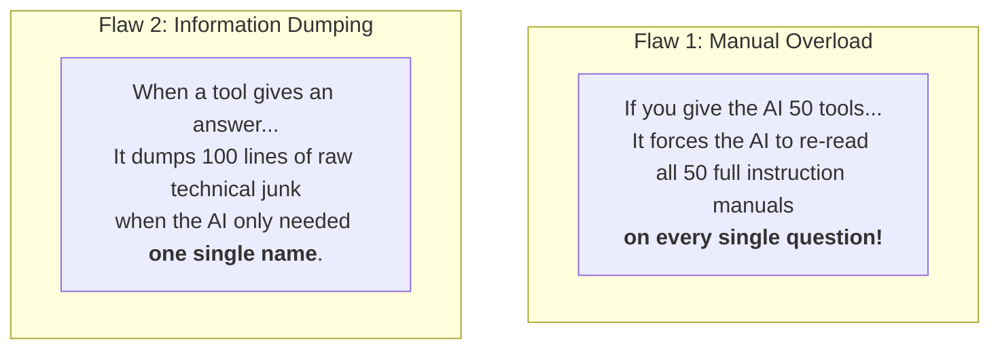
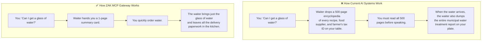
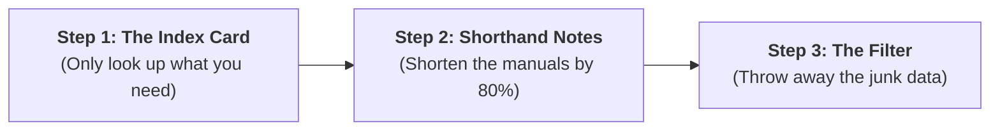
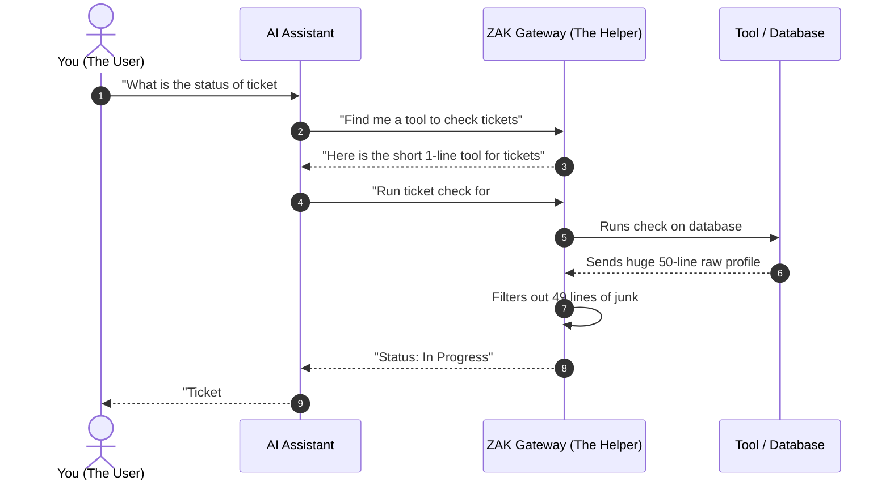

# The Smart Way AI Uses Tools: A Non-Technical Guide

A simple, plain-English explanation of why AI is currently wasting massive amounts of money, and how **ZAK MCP Gateway** fixes it.

---

## 1. The Basics: What Does "AI Tool Use" Mean?

Think of an AI (like ChatGPT, Claude, or Cursor) as a very smart digital assistant.

- By itself, the AI only knows what it learned in the past.
- To do real work, it needs **tools**:
  - A tool to read files on your computer.
  - A tool to look up database records.
  - A tool to send messages on Slack or create GitHub tasks.

Every tool comes with an **instruction manual** that tells the AI:
- What the tool is called.
- What it does.
- What information it needs to run.

---

## 2. What is a "Token" and Why Does It Matter?

- In AI, **tokens** are like words or pieces of words.
- Every time you send a message to an AI, the company charges you based on how many tokens the AI has to read and write.
- **Rule of thumb:** More tokens = **higher bills** and **slower answers**.

---

## 3. The Big Problem in the AI World Today

Right now, the system that connects AI to tools has two major flaws:

Because of this:
- **90% of what the AI reads is completely useless** to the current question.
- Companies and developers waste **thousands of dollars** every month.
- The AI becomes **slower** and gets **confused** by too much clutter.

---

## 4. The Restaurant Analogy

To understand this easily, imagine going to a restaurant:

---

## 5. How Our Gateway Solves It (The 3 Simple Steps)

**ZAK MCP Gateway** sits in the middle like a smart personal assistant. It uses three simple steps:

### 1. The Index Card (On-Demand Lookup)
- Instead of handing the AI 50 manuals at once, the gateway hands the AI a tiny **1-page index card**.
- The AI only asks for the manual it actually needs, right when it needs it.

### 2. Shorthand Notes (Writing in Short Code)
- Standard manuals are full of repetitive computer code.
- The gateway translates these bulky manuals into **compact shorthand**.
- This cuts the manual size by **more than 80%**, while the AI still understands it perfectly.

### 3. The Filter (Keeping Only What Matters)
- When a tool returns a massive pile of data (like an 80-line user profile), the gateway acts like a highlighter pen.
- It extracts the **2 or 3 lines** the AI asked for, throws away the rest, and sends back a clean answer.

---

## 6. How It Looks in Action

---

## 7. What Are the Real Benefits?

| Benefit | Without Gateway | With ZAK Gateway | Real-World Impact |
| :--- | :--- | :--- | :--- |
| **Cost** | High ($1.50+ per conversation) | Low ($0.05 per conversation) | **Up to 95% cheaper bills** |
| **Speed** | 3 to 4 seconds wait time | Less than half a second | **Instant answers** |
| **Accuracy** | Gets distracted by junk text | Stays focused on the goal | **Fewer mistakes and hallucinations** |

---

## 8. Summary in One Sentence

> **ZAK MCP Gateway stops AI from reading 500 pages of useless instructions and filtering through piles of junk data, making AI 10x faster and up to 95% cheaper.**
