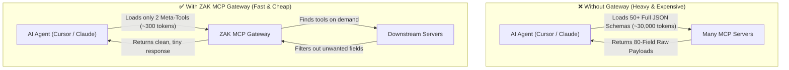
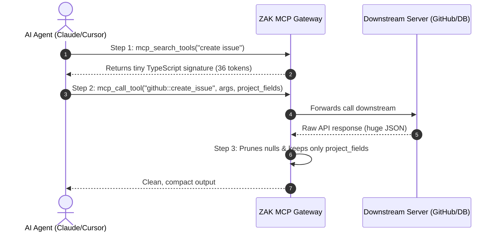
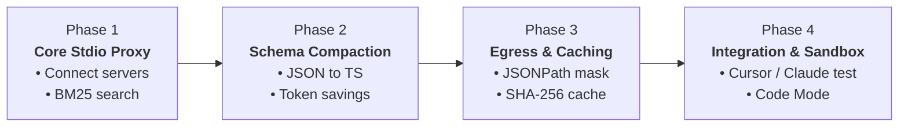
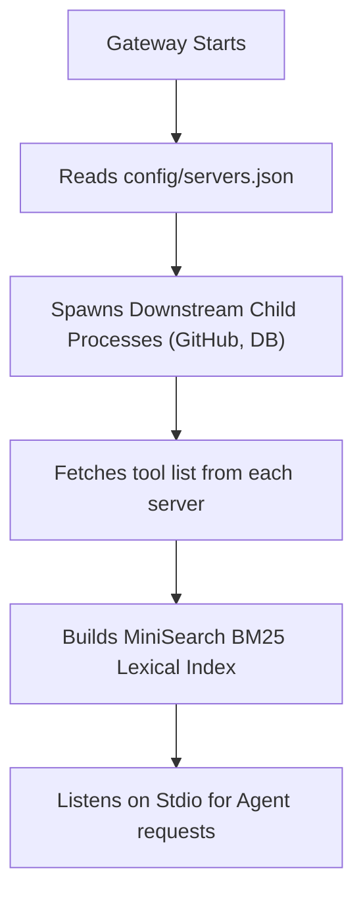
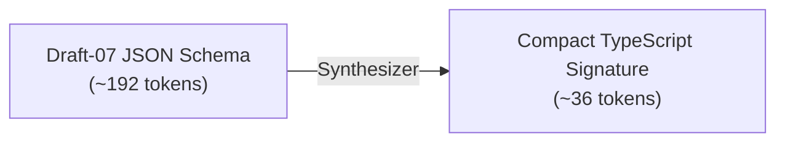
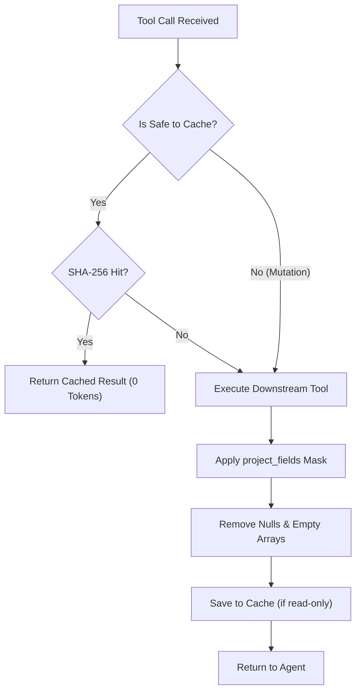
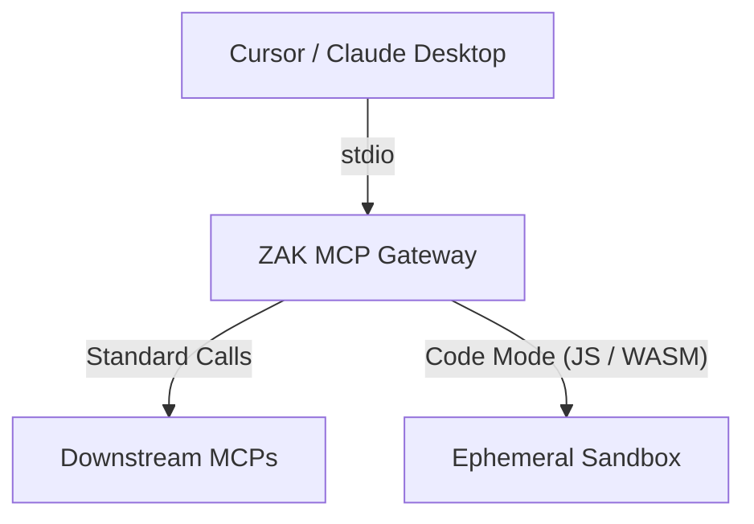

# ZAK MCP Gateway: Implementation Roadmap & Architecture Guide

A simple, phase-by-phase guide to building the Token-Optimized MCP Gateway.

---

## 1. What is ZAK MCP Gateway?

- AI agents waste thousands of tokens loading large tool schemas on startup.
- Raw tool outputs also dump huge JSON files into the AI conversation.
- **ZAK MCP Gateway** sits in the middle as an intelligent filter.
- It exposes only 2 meta-tools, converts schemas to short TypeScript, and trims unnecessary data.

---

## 2. Before vs After: The Core Difference

---

## 3. How It Works (In 3 Simple Steps)

---

## 4. Phase-Wise Development Roadmap

---

### Phase 1: Core Stdio Proxy & Discovery (MVP)

**Goal:** Allow the AI agent to connect to the gateway and search for tools.

**Tasks:**
- Read server configurations from `config/servers.json`.
- Connect to downstream MCP servers over stdio child processes.
- Index all tool names and descriptions in `MiniSearch`.
- Serve `mcp_search_tools` to the AI client.

---

### Phase 2: Schema Compaction (JSON Schema ➔ TypeScript)

**Goal:** Reduce schema token consumption by over 80%.

**Tasks:**
- Strip out structural keywords like `properties`, `type`, and `additionalProperties`.
- Convert parameter definitions into clean TypeScript function signatures.
- Add server namespaces (for example, `github::create_issue`).
- Verify syntax with automated unit tests.

---

### Phase 3: Egress Filtering & Smart Caching

**Goal:** Eliminate payload flooding and prevent duplicate tool executions.

**Tasks:**
- Implement `project_fields` to extract only requested keys (e.g. `status.name`).
- Prune `null`, `undefined`, and empty collections.
- Add SHA-256 caching for idempotent/read-only calls.
- Protect mutation tools (`create`, `delete`, `update`) from being cached.

---

### Phase 4: Client Integration & Code Sandbox

**Goal:** Test with real developer tools and support code execution.

**Tasks:**
- Mount the gateway in `claude_desktop_config.json` and `.cursor/mcp.json`.
- Benchmark token consumption in real 15-turn coding sessions.
- Add an isolated sandbox for executing multi-tool scripts in a single roundtrip.

---

## 5. Summary Checklist for Tomorrow

- [x] Folder structure and types configured.
- [x] Baseline compilation and smoke tests passing.
- [ ] Connect real test MCP server (e.g., Filesystem or GitHub).
- [ ] Test `mcp_search_tools` through Stdio pipe.
- [ ] Verify payload trimming on large responses.
